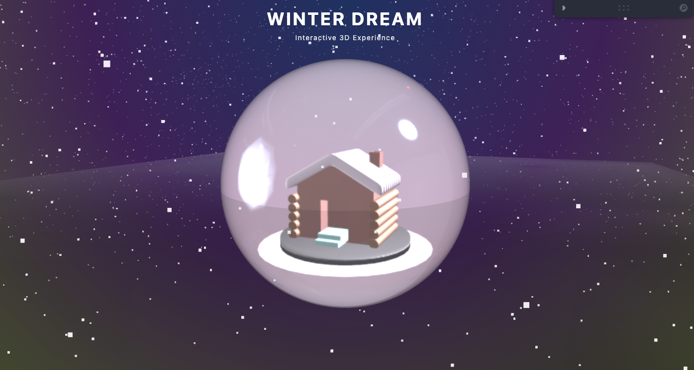

# Snow Globe Renderer

This repository contains a 3D snow globe renderer built with React Three Fiber and Vite. User can rotate the snow globe and zoom in/out.

## Usage

```bash
npm install
npm run dev
```

<p align="center">

</p>
